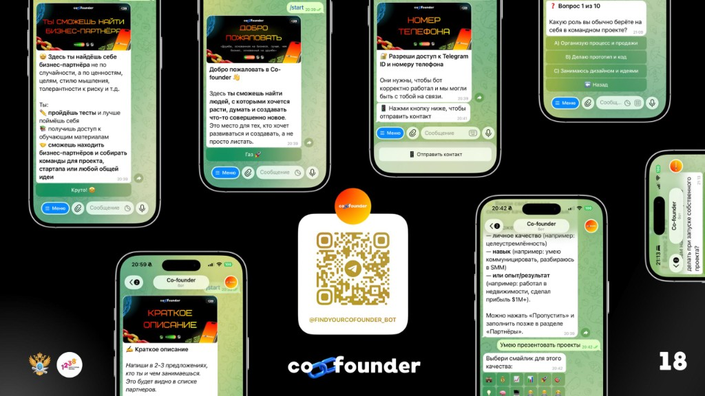
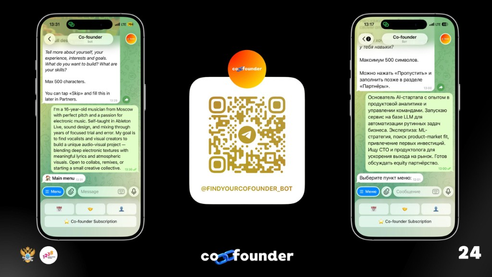
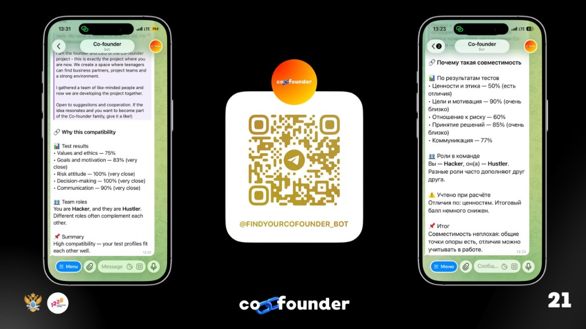
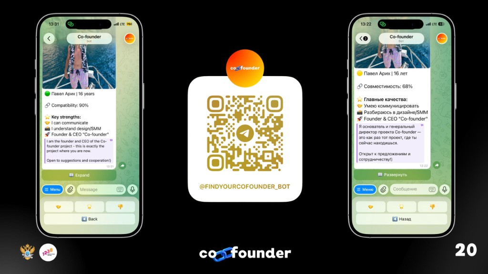

# Co-founder Bot

A Telegram bot for finding someone to build with — a co-founder, startup partner, or just someone on the same wavelength.

**Try it:** [@findyourcofounder_bot](https://t.me/findyourcofounder_bot)

## Why I built this

Me and people I know kept having ideas but no one to team up with — someone who matches your skills, pace, and personality. I wanted it all in one place without installing another app: open Telegram, fill out a short profile, take a test, browse people nearby.

That's how this bot grew — profiles, swipes, events, and two languages (RU / EN).

## What it does

- sign-up with an age check (under 14 gets a learning mode, 14+ gets the full experience)
- profile: photo, city, strengths, descriptions
- compatibility tests and partner search (likes, super-likes, bookmarks, matches)
- events: sign up, pair matching, notifications
- Co-founder Premium (paid via Telegram Stars)
- admin panel for stats, events, and test users

Profiles in the dating section translate to match your UI language — if you're on EN, the other person's bio shows in EN too.

## How to use it

Open the bot → `/start` → finish registration → use the menu: Dating, Events, Profile.

Main commands:

| Command | Who | What |
|---------|-----|------|
| `/start` | everyone | start or restart |
| `/admin` | admins | admin panel |
| `/add_test_user` | admins | add demo users for testing |
| `/delete_test_users confirm` | admins | remove all demo users |

Everything else is mostly buttons in the chat.

## How it works

Under the hood it's a pretty standard Telegram bot stack: **aiogram** handlers receive messages and button taps, **FSM states** walk you through registration step by step, and everything lands in **SQLite** via SQLAlchemy (profiles, swipes, matches, events).

Rough flow:

1. **Onboarding** — age check, legal agreement, phone contact, photo, city, strengths, short & full bio.
2. **Tests** — a main compatibility quiz (values, goals, risk, communication, decision-making). Answers become a profile used for matching.
3. **Discovery** — swipe-style partner cards with a compatibility score. Like, super-like, bookmark, or pass.
4. **Match** — when both sides like each other, the bot opens contact and shows *why* you matched (breakdown by category + team roles like Hacker / Hustler).
5. **Events** — admins post events; users sign up; the scheduler can auto-pair people before the event day.
6. **Translation** — if your UI is EN but someone's profile is RU (or the other way around), `deep-translator` translates their bio on the fly.

No generative AI in production — just rules, stored test scores, and Google Translate for cross-language profiles.

## Screenshots

**Registration & onboarding** — welcome screens, phone step, compatibility test, profile fields (RU interface):

**Profile bio** — users write who they are and what they're looking for; works in both EN and RU:

**Partner card** — browsing someone else's profile with compatibility %, strengths, and swipe actions:

**Compatibility breakdown** — after a match, the bot explains scores by category and suggested team roles:

**Profile menu** — edit profile, tests, people search, premium subscription:

## Stack

Python, aiogram 3, SQLAlchemy + SQLite, deep-translator for profile translation.

## AI use disclosure

I used AI assistants (Cursor / ChatGPT) for parts of the code and docs — mostly to draft handlers faster, debug issues, and sketch early write-ups. I still reviewed, tested, and edited everything myself.

The bot itself does **not** use generative AI at runtime. Profile translation runs through `deep-translator` (Google Translate). OpenRouter is in the config as a placeholder but isn't wired up in the current release.

User-facing copy in `texts/` is mine; AI only helped with wording sometimes.

## Links

- Bot: [@findyourcofounder_bot](https://t.me/findyourcofounder_bot)
- Telegram channel: [@cofounderapp](https://t.me/cofounderapp)
- Website: coming soon

## License

[MIT](LICENSE)
